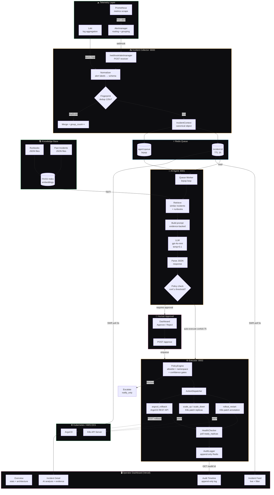

```mermaid
flowchart TD
    subgraph TELEMETRY["☁  Telemetry Layer"]
        PROM[Prometheus\nmetrics scrape]
        LOKI[Loki\nlog aggregation]
        AM[Alertmanager\nrouting + grouping]
        PROM -->|fires alert| AM
    end

    subgraph COLLECTOR["📥  Incident Collector :8000"]
        WH["/webhook/alertmanager\nPOST receiver"]
        NORM[Normalizer\nalert labels → schema]
        DEDUP{Fingerprint\ndedup 120s?}
        INC[IncidentContext\ncanonical object]
        WH --> NORM --> DEDUP
        DEDUP -->|new| INC
        DEDUP -->|duplicate| MERGE[Merge + group_count++]
    end

    subgraph QUEUE["⚡  Redis Queue"]
        RQ[(agent:queue\nbrpop)]
        STORE[(incident:id\nTTL 1h)]
    end

    subgraph KNOWLEDGE["📚  Knowledge Base"]
        RB[Runbooks\nJSON files]
        HIST[Past Incidents\nJSON files]
        FAISS[(FAISS Index\nembeddings)]
        RB --> FAISS
        HIST --> FAISS
    end

    subgraph AGENT["🤖  AI Agent :8001"]
        WORKER[Queue Worker\nbrpop loop]
        RETRIEVE[Retrieve\nsimilar incidents\n+ runbooks]
        PROMPT[Build prompt\nevidence-backed]
        LLM[LLM\ngpt-4o-mini\ntemp=0.1]
        PARSE[Parse JSON\nresponse]
        POLICY1{Policy check\nconf ≥ threshold?}
        WORKER --> RETRIEVE --> PROMPT --> LLM --> PARSE --> POLICY1
    end

    subgraph APPROVAL["👤  Human Approval"]
        UI_APPROVE[Dashboard\nApprove / Reject]
        API_APPROVE[POST /approve]
        UI_APPROVE --> API_APPROVE
    end

    subgraph EXECUTOR["⚙️  Executor :8002"]
        POLICY2[PolicyEngine\nallowlist + namespace\n+ confidence gates]
        DISPATCH[ActionDispatcher]
        RESTART[rollout_restart\nK8s patch annotation]
        SCALE[scale_up / scale_down\nK8s patch replicas]
        ROLLBACK[argocd_rollback\nArgoCD REST API]
        HEALTH[HealthChecker\npoll ready_replicas]
        AUDIT[AuditLogger\nappend-only Redis]
        POLICY2 --> DISPATCH
        DISPATCH --> RESTART & SCALE & ROLLBACK
        RESTART & SCALE & ROLLBACK --> HEALTH --> AUDIT
    end

    subgraph PLATFORM["☸  Kubernetes / AWS EKS"]
        K8S[K8s API Server]
        ARGOCD[ArgoCD]
        RESTART -.->|patch| K8S
        SCALE -.->|patch| K8S
        ROLLBACK -.->|POST rollback| ARGOCD
    end

    subgraph DASHBOARD["🖥  Operator Dashboard (Vercel)"]
        OVERVIEW[Overview\nstats + architecture]
        FEED[Incident Feed\nlive + filter]
        DETAIL[Incident Detail\nAI analysis + evidence]
        AUDIT_UI[Audit Timeline\nappend-only log]
    end

    %% Main flow
    AM -->|webhook| WH
    LOKI -->|query logs| NORM
    INC --> STORE
    INC --> RQ
    STORE -->|read| WORKER
    RQ --> WORKER
    FAISS -->|top-k| RETRIEVE
    POLICY1 -->|auto-execute conf≥0.75| EXECUTOR
    POLICY1 -->|requires approval| APPROVAL
    API_APPROVE -->|enqueue| EXECUTOR
    POLICY2 -->|blocked| ESCALATE[Escalate\nnotify_only]

    %% Dashboard reads
    STORE -->|SWR poll 5s| FEED
    STORE -->|SWR poll 3s| DETAIL
    AUDIT -->|GET /audit/:id| AUDIT_UI

    %% Styles
    classDef service fill:#0d0d10,stroke:#f59e0b,color:#e8e4d9
    classDef queue fill:#0d0d10,stroke:#38bdf8,color:#e8e4d9
    classDef external fill:#0d0d10,stroke:#4ade80,color:#e8e4d9
    classDef human fill:#0d0d10,stroke:#f472b6,color:#e8e4d9
    class COLLECTOR,AGENT,EXECUTOR service
    class QUEUE queue
    class PLATFORM,TELEMETRY,KNOWLEDGE external
    class APPROVAL,DASHBOARD human
```
